# Water Quality Statistics

We developed a series of linear mixed effects models to estimate
concentrations for constituents of concern (COCs) in Puget Sound urban
stormwater. Spatial covariates in the models included various landscape
predictors, rainfall, and in some models, percent land use (commercial,
industrial, residential).

## Data Sources

### Outfall Data

The primary source of measured stormwater data is the S8.D Municipal
Stormwater Permit Outfall Data (referred to as the S8 Data in this
document) provided by the Washington Department of Ecology (William
Hobbs et al. 2015). Special Condition S8.D of the 2007-2012 Phase I
Municipal Stormwater Permit required permittees to collect and analyze
data to evaluate pollutant loads in stormwater discharged from different
land uses: high density (HD) residential, low density (LD) residential,
commercial, and industrial. Phase I Permittees\[1\] collected water
quality and flow data, sediment data, and toxicity information from
stormwater discharges during storm events. Stormwater data collected
from a total of 16 outfalls by six Phase I Permittees was utilized in
this modeling study.

The stormwater outfall data is available from Ecology via an open-data
api at:
[https://data.wa.gov/Natural-Resources-Environment/Municipal-Stormwater-
Permit-Outfall-Data/d958-q2ci.](https://data.wa.gov/Natural-Resources-Environment/Municipal-Stormwater-%20Permit-Outfall-Data/d958-q2ci.%20)

COCs analyzed in this study are:

- Copper – Total

- Total Suspended Solids (TSS)

- Phosphorus – Total

- Nitrite-Nitrate – Dissolved – still to be analyzed

- Zinc – Total – still to be analyzed

- Zinc – Dissolved – still to be analyzed

We extracted data for these COCs, and performed minimal data cleaning.
We filtered out rejected data (values with a R or REJ flag), removed
replicates, and removed one data point for Nitrite-Nitrate that was an
obvious outlier (an order of magnitude higher than the rest of the
data). Figure 4.1 shows data before removal of the outlier.


**Figure 4.1** All observations with outlier in place for Nitrite-Nitrate

### Censored (Non-Detect) Data

Nearly all COCs had non-detect (left-censored) data present (Table 4.1).
Ecology flagged non-detect data and provided the reporting limit for
each non-detect value. All COCs had a very small percentage of data that
were non-detect (2% or less); non-detect values were substituted with
one-half of the reporting limit.

**Table 4.1** Percentage of data points that were left-censored (non-detect)
for each chemical of concern

| Chemical of Concern    | Censored Data Percentage | Notes                                                                                                                                                                                                                                           |
|------------------------|--------------------------|-------------------------------------------------------------------------------------------------------------------------------------------------------------------------------------------------------------------------------------------------|
| Total Copper           | 0%                       | 4 samples were field blanks misclassified as ND’s. Censored data percentage was calculated following removal of these 4 field blanks.                                                                                                           |
| Nitrite-Nitrate        | 0.23%                    |                                                                                                                                                                                                                                                 |
| Phosphorus             | 1.17%                    | 3 samples with high results were classified as ND’s, but should have been flagged as “estimated”. Censored data percentage was calculated following reclassification of these 3 data points.                                                    |
| Total Suspended Solids | 0.83%                    |                                                                                                                                                                                                                                                 |
| Dissolved Zinc         | 0.22%                    | 4 samples were field blanks misclassified as ND’s. 2 samples with high results were classified as ND’s, but should have been flagged as “estimated”. Censored data percentage was calculated following reclassification of these 6 data points. |
| Total Zinc             | 0%                       | 4 samples were field blanks misclassified as ND’s. Censored data percentage was calculated following removal of these 4 field blanks.                                                                                                           |

### Transformation of outfall data

Each COC was then evaluated for its underlying distribution, to
determine whether transformation would be beneficial prior to running a
linear mixed effects model on the results. Quantile-quantile plots (QQ
plots) using a normal distribution, gamma distribution, square-root
transformed distribution, and log-transformed distribution were visually
analyzed. For all COC’s, log-transformation was deemed an appropriate
data transformation prior to model analysis (Fig. 4.2).

 

**Figure 4.2** Quantile-quantile plots of COCs using a natural-log (ln) scale.
Red line shows the QQ-line.

## Spatial Data

For this study, we did not rely on the permittee’s self-reported land
use type to run regression models predicting pollution loading from land
use. A visual scan of our land cover data layer versus self-reported
land use types revealed little agreement among permittee definitions of
the four land use types (high density residential, low density
residential, commercial, industrial). Therefore, we compiled a suite of
continuous datasets from which to run chemical loading models. We divide
these into land use and landscape data.

### Land Use

In order to employ a consistent analysis across different monitored
watersheds we extracted land use data from the Washington Department of
Commerce Land Use data set (<a href="<https://www.commerce.wa.gov/serving-communities/growth-management/puget-sound-mapping-project/" class="uri"><del>https://www.commerce.wa.gov/serving-communities/growth-management/puget-sound-mapping-project</del></a>). Land use classes (also listed in Table
4.2) include:

- Intensive urban (includes commercial areas, apartment buildings)

- Urban residential (includes the majority of urban and suburban
    single-family dwellings)

- Rural residential

- Industrial

In addition, we combined some land use classes to generate additional
land use classes:

- Total residential (urban residential + rural residential)

- Intensive Urban + Industrial; the industrial land use category did
    not have many non-zero data points

### Landscape Data

For each watershed contained in the S8 dataset, potentially relevant
landscape data were extracted from the following sources (Table 4.2):

**Table 4.2**: Sources of landscape spatial predictor data used to develop statistical models.

| **Layer**                             | **ID**            | **Source**                                                                       |
|---------------------------------------|-------------------|----------------------------------------------------------------------------------|
| urban residential                     | urbRES            | Washington State Department of Commerce, Puget Sound Mapping Project             |
| rural residential                     | ruRES             |                                                                                  |
| total residential (urban + rural)     | totRES            |                                                                                  |
| intensive urban                       | intURB            |                                                                                  |
| industrial                            | IND               |                                                                                  |
| intensive urban + industrial          | intURB\_IND       |                                                                                  |
| impervious surfaces                   | impervious        |                                                                                  |
| paved surfaces                        | paved             |                                                                                  |
| rooftop density                       | roofs             |                                                                                  |
| urban residential rooftops            | roof\_urbRES      | rooftop density applied to Washington State Department of Commerce Land Use data |
| total residential rooftops            | roof\_totRES      |                                                                                  |
| intensive urban rooftops              | roof\_intURB      |                                                                                  |
| intensive urban + industrial rooftops | roof\_intURB\_IND |                                                                                  |
| grass & low vegetation                | grass             |                                                                                  |
| tree cover                            | trees             |                                                                                  |
| total vegetative cover                | greenery          |                                                                                  |
| undeveloped areas                     | nodev             |                                                                                  |
| traffic                               | traffic           |                                                                                  |
| population                            | popn              |                                                                                  |
| particulate matter 2.5um              | pm25\_na          |                                                                                  |
| particulate surface area              | partSA            |                                                                                  |
| NO2                                   | no2               |                                                                                  |
| carbon emissions, commercial          | CO2\_com          | Vulcan Carbon Dioxide Emissions data set                                         |
| carbon emissions, residential         | CO2\_res          |                                                                                  |
| carbon emissions, road                | CO2\_road         |                                                                                  |
| carbon emissions, nonroad             | CO2\_nonroad      |                                                                                  |
| carbon emissions, total               | CO2\_tot          |                                                                                  |
| slope                                 | slope             |                                                                                  |
| age of development                    | devAge            | Calculated value based on year of development                                    |

### Pre-processing of spatial data

In order to use the landscape data at an appropriate scale across the
study area, spatial predictors were stacked and then convolved with a
100-meter gaussian kernel. **This resulted in a “fuzzy” this word is
unclear to me – it makes me dubious that the predictors will be
sufficient to identify correlations with chemicals of concern in
watersheds predictors that could apply across dataset boundaries.** These
values were then extracted for each monitored watershed.

Prior to use, spatial data were plotted and visually assessed for
outliers (Fig. 4.3). Square-root transformation was performed on spatial
data sets with outliers that were higher than the rest of the
predictor’s values: popn, slope, CO2\_res, CO2\_com, CO2\_road,
CO2\_nonroad, CO2\_tot. The devAge spatial predictor had a low data
outlier; devAge values were squared to address the low outlier. Figure
4.4 shows the spatial data following transformation.

Prior to use in models, spatial data sets were scaled and centered using
the mean and standard deviation from the 14 watersheds in this study.

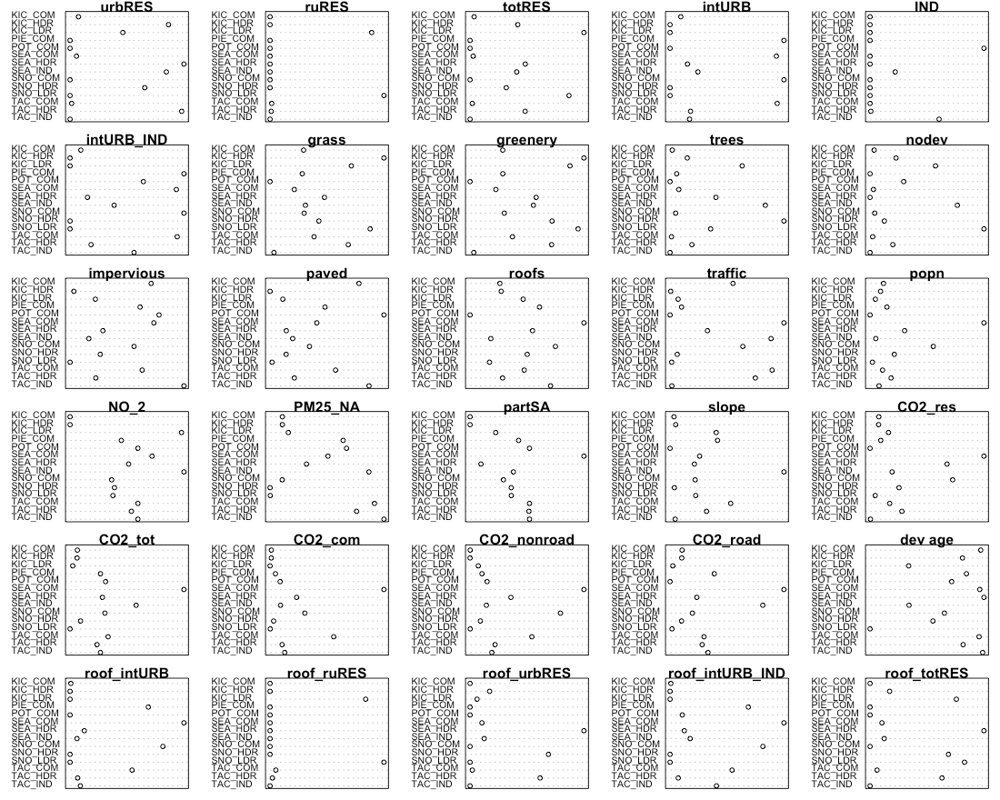 

**Figure 4.3** Raw spatial data

 

**Figure 4.4** Spatial data following transformation

### Precipitation Data

Daily rainfall data were obtained from the DayMet website operated by
NASA (<https://daymet.ornl.gov/>). Daily data were obtained for years
2009 to 2013, and cumulative one day, three day, and seven day, 14-day,
21-day and 28-day antecedent precipitation were calculated for each
sampling date. For example, for a sampling date of March 22, cumulative
three-day precipitation would include precipitation occurring on March
20, 21 and 22. For each COC, *ln*-transformed chemical concentrations
were plotted against each precipitation measurement, and the plots were
visually assessed to select the most appropriate time scale for
precipitation. Cumulative 21-day precipitation was selected for copper
and phosphorus, while 1-day precipitation was selected for TSS.

## Model Construction and Selection

Model selection was performed using the methodology of Zuur et
al. (2009), as outlined in the steps below.

### Step 1. Select strong potential predictors

The initial step was to find a suitable set of potential predictors for
the COC in question. Single-predictor linear models were constructed for
the relationship between *ln*-transformed chemical concentration and
each landscape or land use predictor, in turn. Plots were visually
assessed to determine candidate predictors for linear mixed effects
models. We looked for slopes with a p-value of &lt; 0.05, and for data
points to fall roughly along the best fit model line. If prior knowledge
indicated the importance of certain predictors, those were also included
in the set of candidate predictors.

### Step 2. Control for collinearity

To prevent using highly correlated landscape parameters together in
statistical models, we calculated the correlation coefficient for each
pair of landscape predictors. Highly correlated landscape parameters
(correlation coefficient ≥ 0.85) were not used together in any models.

### Step 3. Control for heterogeneity (heteroskedasticity)

Once a strong set of potential predictors was found, we constructed a
generalized least squares (gls) model in R, using all potential
predictors that were not highly correlated. Normalized residuals from
this “beyond-optimal” were plotted against the model’s fitted values,
and examined for heteroskedasticity. We also plotted residuals against
agency, year, season, land use, precipitation, antecedent dry days, and
all potential predictors, to look for patterns in residuals. If residual
plots showed evidence of heteroskedasticity, we tried a series of gls
models with different variance structures that utilized agency, season,
and precipitation as variance covariates. Variance structure for each
COC was selected as that of the model with the lowest Akaike information
criterion (AIC) value.

### Step 4. Find the proper random effects structure

Next, we used the beyond-optimal model with the correct variance
structure to find the proper random effects structure. The
beyond-optimal gls model was compared to a linear mixed effects (lme)
random intercept model, where the intercept was allowed to change per
agency. Because the gls model and the random intercept model are nested,
the two models were compared using the likelihood ratio test to see if
one model was significantly better than the other (p-value &lt; 0.05).
The best-fit model was then selected based on the lowest AIC value. For
all COCs, the random intercept model fit the data better than the gls
model with no random effects.

A random intercept for agency makes sense for the stormwater data,
because there were opportunities for each agency to differ slightly in
sample collection methodologies. Selection of lab for sample analysis,
timing of sample collection once a storm began, and any biases in
selection of representative watersheds by each agency are possible
factors that could lead to unintended differences in COC results. These
unintended differences can be captured in the random component of the
model.

### Step 5. Check for temporal and spatial correlation

The beyond-optimal model with the correct variance structure and random
effects structure was then examined for evidence of temporal and spatial
auto-correlation. Temporal auto-correlation plots were generated and
visually assessed for indications of correlation between various
sampling time lags; no evidence of temporal autocorrelation was found
for any COC.

To assess for spatial auto-correlation, we used two methods: variograms,
and spatially-explicit bubble plots of model residuals.

All tests for temporal and spatial auto-correlation were repeated
following selection of best-fit models.

### Step 6. Find the proper fixed effects structure

We used the strong potential predictors from step 1 to generate a
set of fixed-effects formulae with combinations of one, two and three
potential predictors. Predictors with high correlation coefficients
(&gt;= 0.85) were not allowed to be in formulae together.

Linear mixed effects models were applied in R using the nlme package. A
set of models was generated using the fixed effects formulae, along with
the best-fit random effects and variance structures identified in steps
3 and 4. Models where the sign (+ or –) of the predictor
coefficients did not match the coefficient signs from the linear model from
step 1 were discarded. Models were then sorted according to AIC
value, and the top 20 models were examined for fit to individual
predictors. Plots of residuals versus fitted values, agency, location,
and predictors were also examined. Based on these data, one to three
models were selected for further consideration. These models all had low
AIC values, decent residual plots, and good fit to individual predictors

Using knowledge of chemical contaminant mobilization into stormwater, we
selected the best landscape predictor model for each COC.

### Final model comparison

Three models were ultimately compared for each COC:

1. **Null Model:** COC concentration is equal to median COC
    concentration over all sampling dates and locations

2. **Categorical Land Use Model:** COC concentration is modeled as a
    linear mixed effects model, utilizing land use category (HDR, LDR,
    COM, IND), precipitation (rainfall and/or antecedent dry days), and
    season (for COCs where a seasonal trend appeared in the data).

3. **Landscape Predictor Model:** COC concentration is modeled as a
    linear mixed effects model, utilizing up to three landscape
    predictors, precipitation (rainfall and/or antecedent dry days), and
    season (for COCs where a seasonal trend appeared in the data).

## Results

Results for each COC are provided below.

### Copper

Based on linear models of *ln*-transformed copper versus individual
predictors, the strong predictors identified for copper include: intURB,
intURB\_IND, totRES, grass, greenery, impervious, nodev, traffic,
sqrt\_popn, pm25\_na, sqrt\_CO2\_tot, sqrt\_CO2\_com, sqrt\_CO2\_road,
sqrt\_CO2\_nonroad, devAge2, roof\_intURB\_IND (Fig 4.5).

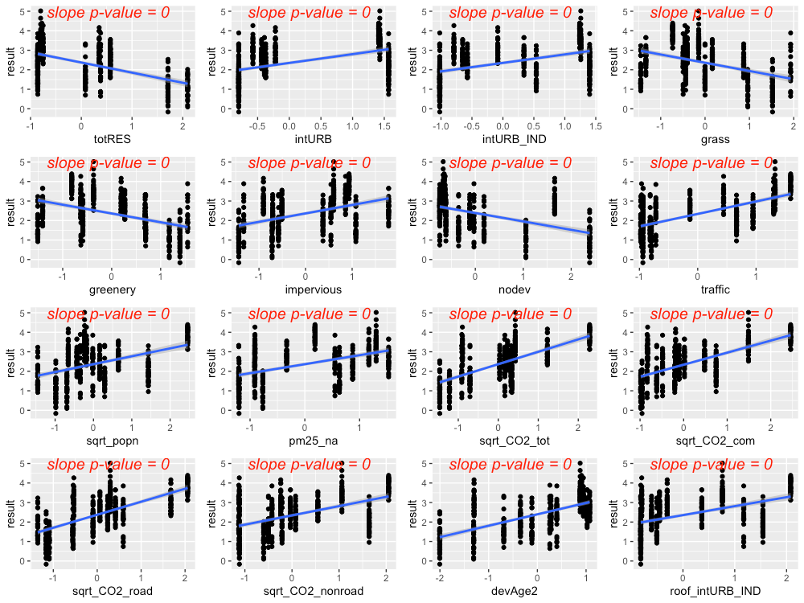 

**Figure 4.5** Strong predictors for copper, showing linear model fit (blue
line) for the relationship between ln-transformed copper concentration
and each predictor in turn.

The precipitation predictor used for copper was 21-day cumulative
precipitation. In addition, evidence of higher copper concentrations
during summer lead us to add *summer* as a categorical predictor to the
copper model (where *summer* = 1 during July, August, September, and
*summer* = 0 for all other months).

Residuals plotted against fitted values showed signs of slight
heterogeneity (Fig 4.6, left plot). Of the variance structures tested,
the best fit was for a combination of two variance structures, where
residual variation differs by agency *j*, and also by rainfall at each
location *i* and date *k*. Parameters δ<sub>1</sub> and δ<sub>2</sub>
are estimated by the model.

 var(*ε*<sub>ijk</sub>) = σ<sup>2</sup><sub>j</sub>  (δ<sub>1</sub>- \|rain<sub>ik</sub>\|<sup>δ<sup>2</sup></sup> )<sup>2</sup>

 

**Figure 4.6**  Normalized residuals from beyond-optimal model, with no
variance structure (left), and with the best fit variance structure
(right).

The best model for copper is a random-intercept model, where the
intercept of the linear model is allowed to shift up or down according
to agency. No signs of temporal or spatial auto-correlation were
detected in auto-correlation plots or variograms.

With the variance structure and random components set, two possible
models emerged to capture the fixed effects:

 ~ rain + summer +traffic +totRES")

 ~ rain + summer + traffic + devAge2 + pm25\_na\ +\ \left(rain\ \times pm25\_na\right)")

The first model’s AIC score was lower than that of the second model
(AIC=743.4 vs. 750.5, when models were fitted with ML); however, the
model coefficient for totRES is negative, indicating that increased
residential zoning results in reduced copper concentrations in
stormwater. This relationship makes sense for the 14 watersheds in our
study, but would likely not be appropriate for forested landscapes that
have low residential zoning (thus should have high copper
concentrations). As a result, we selected the second model as the most
suitable for covering the entire area of the stormwater heatmap. Figure
4.7 shows the model fit for each individual predictor, plotted against
data points. Figure 4.8 shows the interaction between rain and pm25\_na,
with higher pm25\_na values in reds and oranges, and lower pm25\_na
values in blues and purples. This interaction shows that, when pm2.5
values are high, increasing amounts of rainfall result in a dilution of
copper in stormwater.

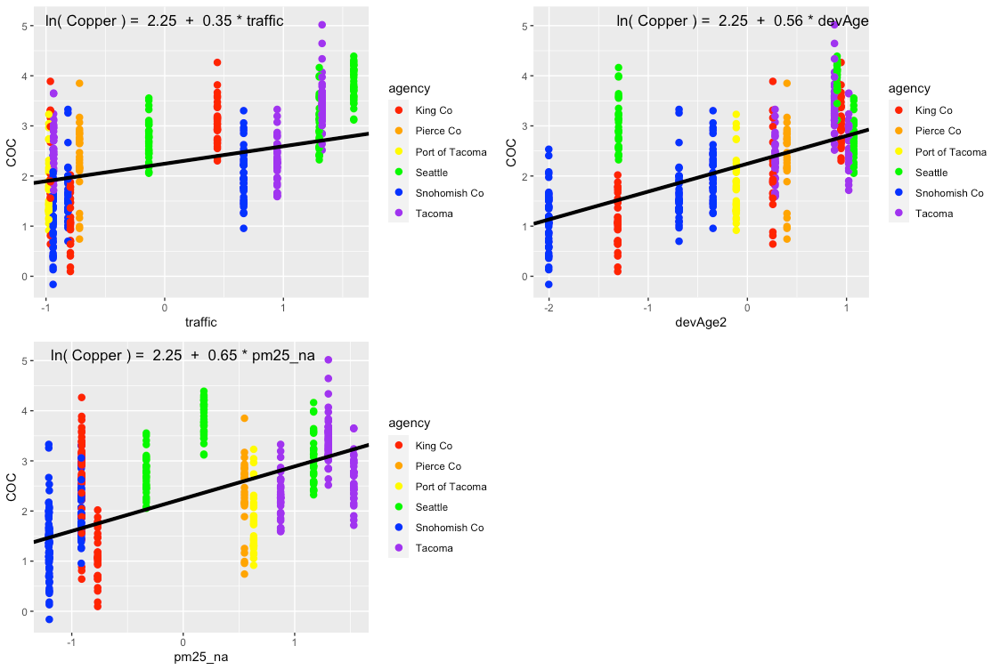 

**Figure 4.7** Single-predictor plots for copper, fit of the Landscape
Predictor Model to each predictor in turn.

 

**Figure 4.8** Plot showing the interaction between rain and pm25_na that is
present in the best fit model. In areas with high pm25_na values,
increasing amounts of rain result in a dilution of copper in stormwater

Comparisons between the Null Model, Categorical Land Use Model, and
Landscape Predictor Model can be visualized through residuals (Fig. 4.9)
and also coefficient values (Table 4.2; Fig. 4.10). Although the AIC
value for the Categorical Land Use Model is lower than that of the
Landscape Predictor Model, we are not confident in the transferability
of the Categorical Land Use Model to watersheds outside of the 14 in
this study. Two of the land use categories (Industrial – IND; and Low
Density Residential – LDR) each have only two watershed representatives
in our study. This results in good model fit to the data, but not
necessarily for all watersheds in Puget Sound area.

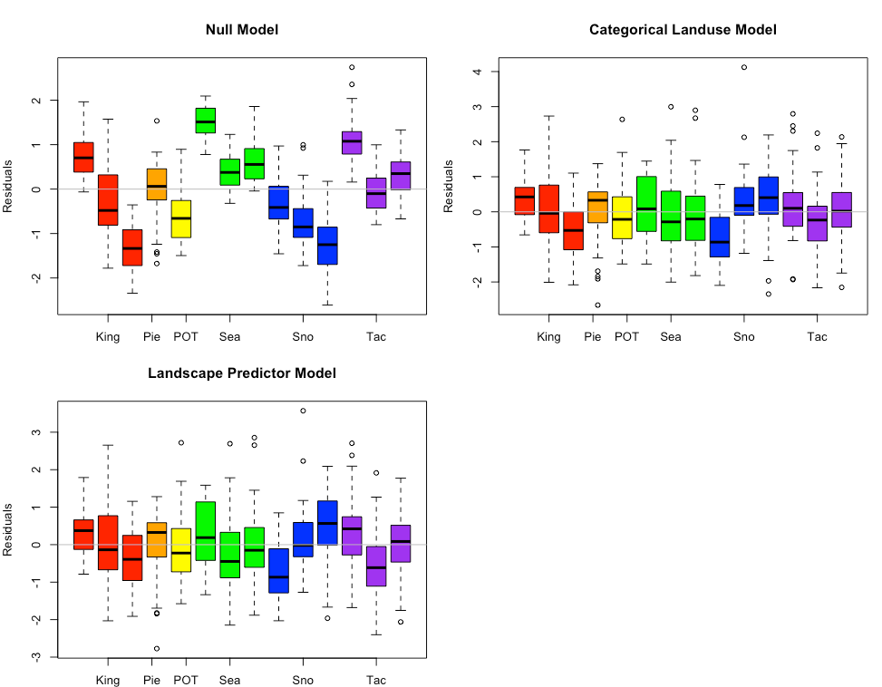 

**Figure 4.9** Copper model residuals for the Null Model, Categorical Land Use
Model, and Landscape Predictor Models. Each bar represents one
watershed, with colors representing agencies.

**Table 4.3** Coefficient values (standard error in parenthesis) for the three
copper models. For the Categorical Landuse Model, the baseline landuse
is LDR; all other land use categories are adjustments from the baseline.
Final coefficient values for linear mix

 

 

**Figure 4.10** Model coefficients for the Null Model (green), Categorical Land
Use Model (blue), and Landscape Predictor Model (red).

### Total Suspended Solids

Based on linear models of *ln*-transformed TSS versus individual
predictors, the strong predictors identified for TSS include: totRES,
traffic, sqrt\_popn, sqrt\_CO2\_res, sqrt\_CO2\_tot, sqrt\_CO2\_com,
sqrt\_CO2\_road, devAge2 (Fig 4.11). Paved was added to the list because
it was a strong predictor for an older version of the model, and paved
areas are associated with elevated TSS in stormwater.

 

**Figure 4.11** Strong predictors for TSS, showing linear model fit (blue line)
for the relationship between ln-transformed TSS concentration and each
predictor in turn. Although it wasn’t as compelling on its own, the
predictor paved was added to the list of strong predictors because it
was a strong predictor in a previous model.

The precipitation predictor used for TSS was 1-day cumulative
precipitation. There was no evidence of seasonal patterns to TSS in
stormwater.

Residuals plotted against fitted values showed signs of slight
heterogeneity (Fig 4.12, left plot). Of the variance structures tested,
the best fit was for a combination of two variance structures, where
residual variation differs by agency *j*, and also by rainfall at each
location *i* and date *k*. The parameters δ is estimated by the model.

```model equation  here```

 

**Figure 4.12** Normalized residuals from beyond-optimal model, with no
variance structure (left), and with the best fit variance structure
(right).

The best model for TSS is a random-intercept model, where the intercept
of the linear model is allowed to shift up or down according to agency.
No signs of temporal or spatial auto-correlation were detected in
auto-correlation plots or variograms.

With the variance structure and random components set, two possible
models emerged to capture the fixed effects:
```model equation  here```

The AIC score for these two models was very close, with the first
model’s AIC score slightly lower (AIC=1246.0 vs. 1246.5, when models
were fitted with ML). In the second model, the coefficient for totRES is
negative, indicating that increased residential zoning results in
reduced TSS in stormwater. This relationship makes sense for the 14
watersheds in our study, but would likely not be appropriate for
forested landscapes that have low residential zoning (thus should have
high TSS concentrations). As a result, we selected the first model as
the most suitable for covering the entire area of the stormwater
heatmap. Figure 4.13 shows the model fit for each individual predictor,
plotted against data points.

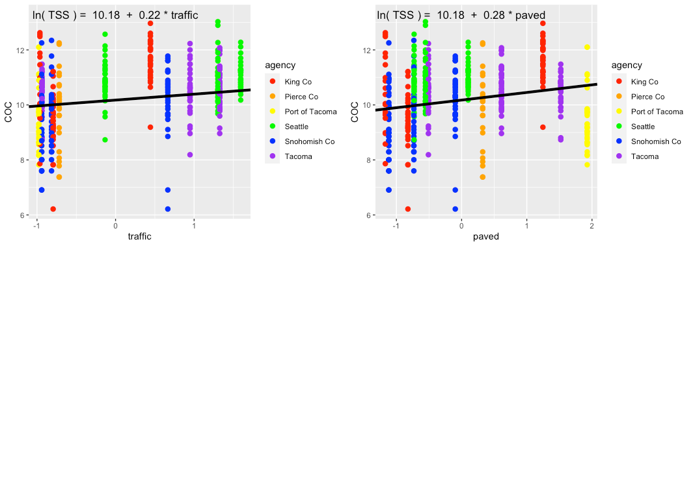 

**Figure 4.13** Single-predictor plots for TSS, showing fit of the
Landscape Predictor Model to each predictor.

Comparisons between the Null Model, Categorical Land Use Model, and
Landscape Predictor Model can be visualized through residuals (Fig.
4.14) and also coefficient values (Table 4.3; Fig. 4.15). The lowest AIC
value is for the Landscape Predictor Model, indicating best fit to the
TSS data of these three models.

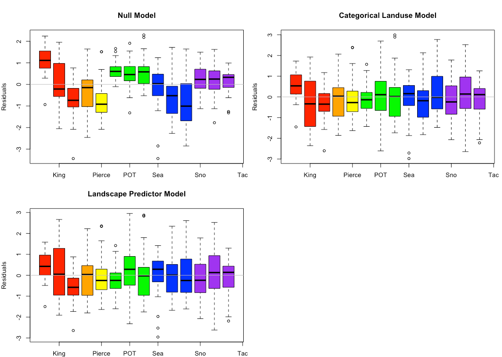 

**Figure 4.14** TSS model residuals for the Null Model, Categorical Land Use
Model, and Landscape Predictor Models. Each bar represents one
watershed, with colors representing agencies.

**Table 4.4** Coefficient values (standard error in parenthesis) for the three
TSS models. For the Categorical Landuse Model, the baseline landuse is
LDR; all other land use categories are adjustments from the baseline.
Final coefficient values for linear mixed effects

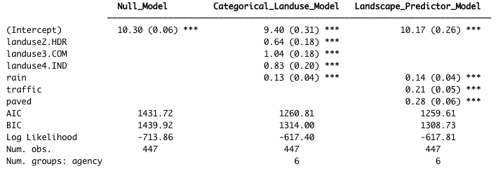 

 

**Figure 4.15** Model coefficients for the Null Model (green), Categorical
Land Use Model (blue), and Landscape Predictor Model (red).

### Phosphorus

Based on linear models of *ln*-transformed phosphorus versus individual
predictors, the strong predictors identified for phosphorus include:
traffic, sqrt\_popn, sqrt\_slope, sqrt\_CO2\_res, sqrt\_CO2\_tot,
sqrt\_CO2\_road and devAge2 (Fig 4.16). Paved and grass were added to
the list because they were strong predictors for an older version of the
model, and both are associated with elevated phosphorus in stormwater.

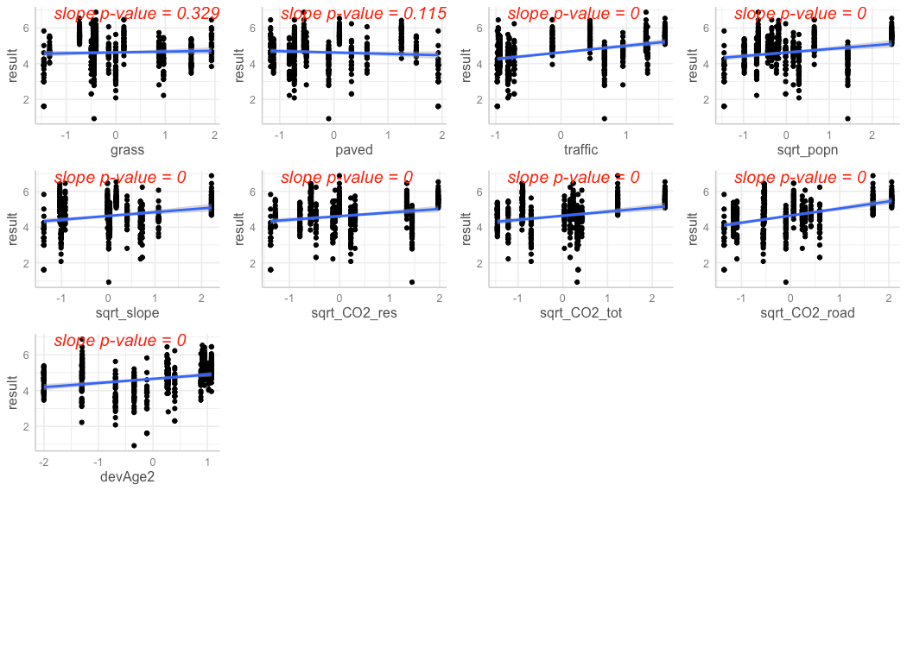 

**Figure 4.16** Strong predictors for phosphorus, showing linear model fit
(blue line) for the relationship between ln-transformed phosphorus
concentration and each predictor in turn. Although they weren’t
compelling on their own, the predictors grass and paved were added to
the list of strong predictors because they were strong predictors in a
previous model.

Strong predictors for phosphorus, showing linear model fit (blue line)
for the relationship between *ln*-transformed phosphorus concentration
and each predictor in turn. Although they weren’t compelling on their
own, the predictors grass and paved

The precipitation predictor used for phosphorus was 21-day cumulative
precipitation. In addition, evidence of higher phosphorus concentrations
during summer lead us to add *summer* as a categorical predictor to the
phosphorus model (where *summer* = 1 during July, August, September, and
*summer* = 0 for all other months).

Residuals plotted against fitted values showed signs of slight
heterogeneity (Fig 4.17, left plot). Of the variance structures tested,
the best fit allows residual variation to differ by agency *j*.
```model equation  here```
Figure 14 Normalized residuals from beyond-optimal model, with no
variance structure (left), and with the best fit variance structure
(right).

**Figure 4.17**

The best model for phosphorus is a random-intercept model, where the
intercept of the linear model is allowed to shift up or down according
to agency. No signs of temporal or spatial auto-correlation were
detected in auto-correlation plots or variograms.

With the variance structure and random components set, two possible
models emerged to capture the fixed effects:

```model equation  here```

The AIC score for these two models was close, with the first model’s AIC
score lower than that of the second model (AIC=830.3 vs. 839.8, when
models were fitted with ML). As a result, we selected the first model.
Figure 4.18 shows the model fit for each individual predictor, plotted
against data points.

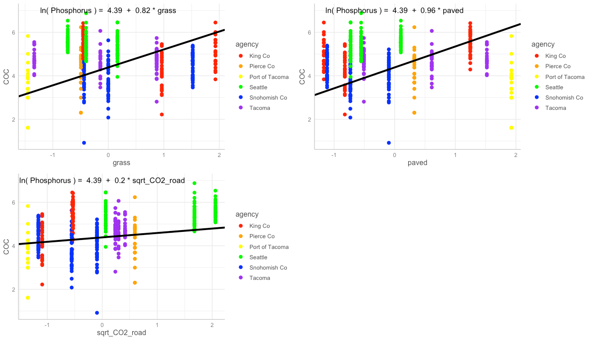 

**Figure 4.18** Single-predictor plots for phosphorus, showing fit of the
Landscape Predictor Model to each predictor.

Comparisons between the Null Model, Categorical Land Use Model, and
Landscape Predictor Model can be visualized through residuals (Fig.
4.19) and also coefficient values (Table 4.4; Fig. 4.20). The lowest AIC
value is for the Landscape Predictor Model, indicating best fit to the
phosphorus data of these three models.

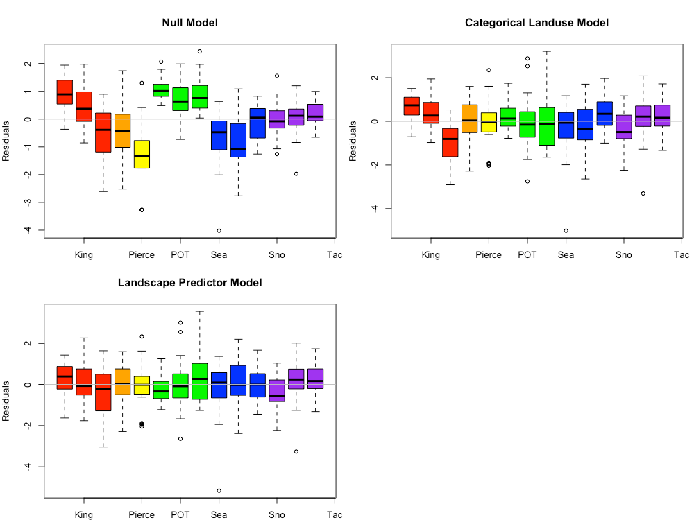 

**Figure 4.19** Phosphorus model residuals for the Null Model, Categorical
Land Use Model, and Landscape Predictor Models. Each bar represents one
watershed, with colors representing agencies.

**Table 4.5** Coefficient values (standard error in parenthesis) for the three
phosphorus models. For the Categorical Landuse Model, the baseline
landuse is LDR; all other land use categories are adjustments from the
baseline. Final coefficient values for linear mixed effects models are
based on fitting with REML.

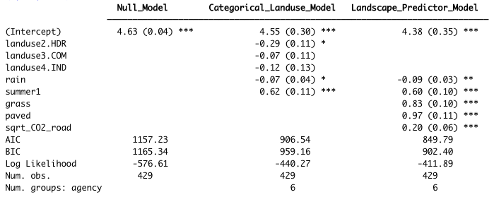 

**Table 4.5** Model coefficients for the Null Model (green), Categorical Land
Use Model (blue), and Landscape Predictor Model (red).

 

**Figure 4.20** Model coefficients for the Null Model (green), Categorical Land Use Model (blue), and Landscape Predictor Model (red).

**Citation:**

Zuur AF, Ieno EN, Walker NJ, Saveliev AA, Smith GM. 2009. Mixed Effects
Models and Extensions in Ecology with R. New York (NY): Springer

\[1\] Phase I Permittees include: cities of Tacoma and Seattle; King,
Snohomish, Pierce and Clark counties; Ports of Tacoma and Seattle. For
this study, all data were used with the exception of those from Clark
County (outside of the Puget Sound region), Port of Seattle (too
different from all other Puget Sound watersheds), and Pierce County High and Low Density Residential (outfall data was collected in a stream rather than at an outfall).

\[2\] See:
<a href="<https://www.commerce.wa.gov/serving-communities/growth-management/puget-sound-mapping-project/" class="uri"><del>https://www.commerce.wa.gov/serving-communities/growth-management/puget-sound-mapping-project</del></a>
